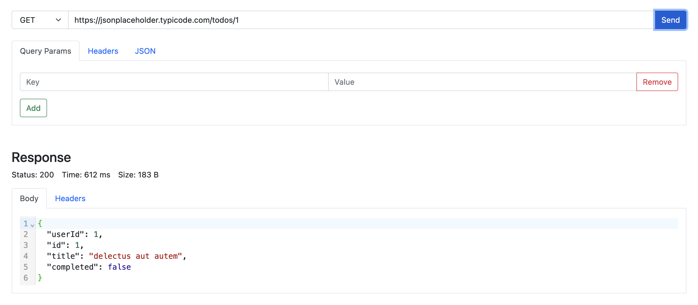

# API Testing Tool

> A simple tool to test your REST APIs. 

## Preview

## Available Scripts

In the project directory, you can run:

### `npm start`

Runs the app in the development mode.

### `npm run build`

Builds the app for production to the `build` folder.
